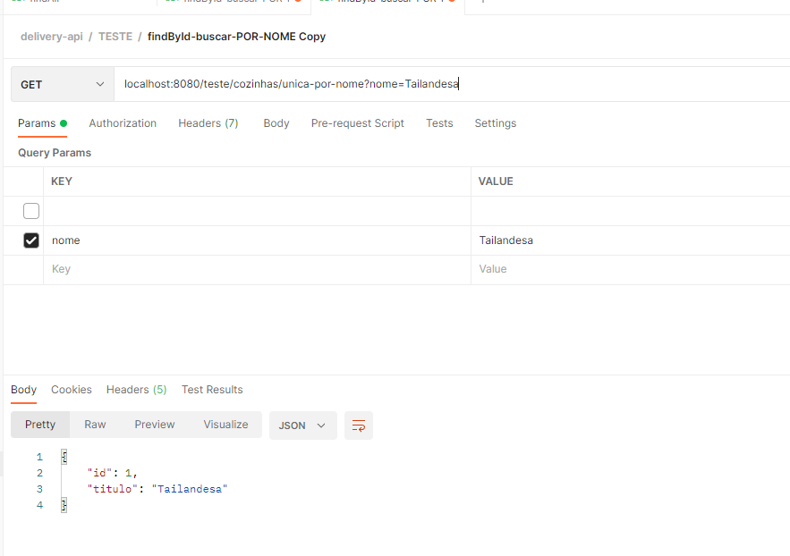
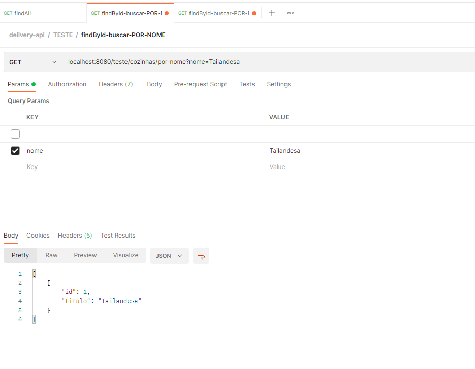
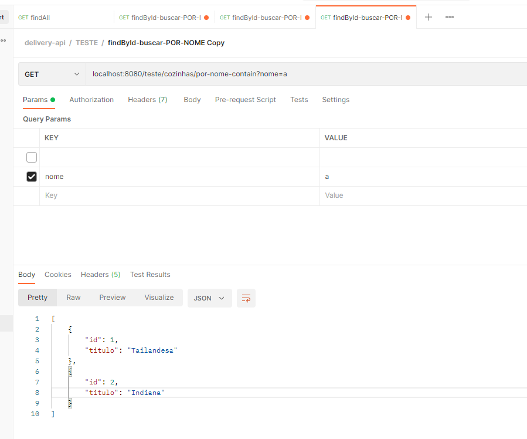
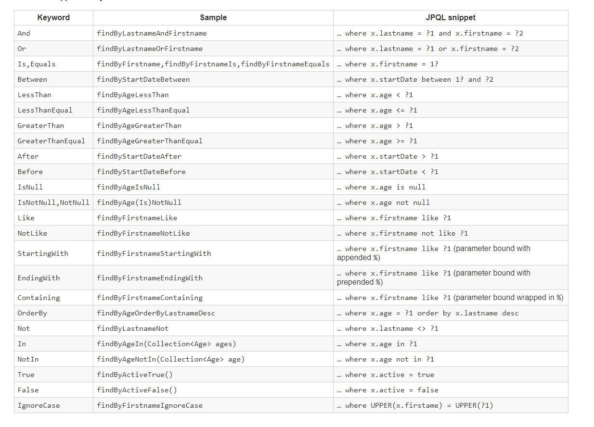
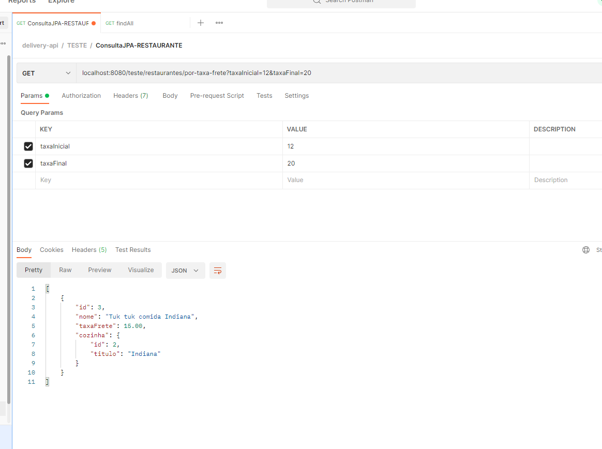
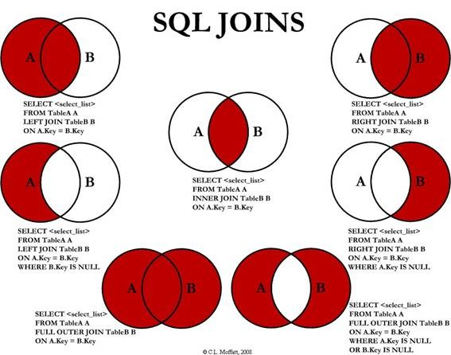

#  MODELAGEM DE REST API - Parte 2  

## Assuntos Abordados 

- Spring Data JPA

## Projeto a ser Desenvolvido

Sistema de Delivery de Comida, tipo Ifood/Uber Eats, Será um MVP(Produto minimo Viavel) de sistema de comidas;

## Tecnologias

- Maven
- Spring Data JPA (biblioteca que vai ajudar a criar repositorio para usa o jakarta persistence)
- POSTMAN (para testar uma restApi, as requisições)
- Mysql Server
- Flyway (ferramenta para gerenciamento de schema de banco de dados, para manutenção das colunas, tabelas relacionamentos e etc)
- Spring Boot DevTools (restarta a aplicação automaticamente)

- 
## Spring Data JPA

Quando implementamos o nosso código existe muito código boilerPlate, ous eja código repetitivo. Nas implementações dos nossos
códigos nós temos muita coisa repetida.

O spring Dtaa JPA é um subprojeto do spring Data, ele é focado em ajudar a implementar repositórios JPA com muito mais produtividade, 
eliminando boa parte do código boiler plate, para criar um repositório com spring data JPA, basta que criemos uma interface 
que herda outra interface do próprio spring data jpa. A nossa interface que herda uma interface dele. Em tempo de execução o Spring
Data JPA instancia para nós uma implementação com vários métodos, como de pesquisa, paginação e outros. E quando queremos um novo
método de consulta que ele não fornece, então temos que criar esse método de consulta, e mesmo assim na maioria das vezes temos apenas
declarar a assinatura na interface que não tem implementação e ele mesmo fornece uma implementação em tempo de execução.

Temos apenas uma interface sem classe implementando ela. O spring Data JPA implementa para nós. O Spring Data JPA ajuda a eliminar
código boiler plate nós não perdemos o controle, pois podemos criar metodos customizados.

Ele fornece uma estrutura que funciona com JPA e fornece uma abstração completa sobre a camada de acesso a dados . O Spring Data JPA traz
o conceito de Repositórios JPA, um conjunto de Interfaces que define métodos de consulta. O Repository e o Entity Bean representam a 
camada DAO no aplicativo.

Spring Data NÃO é uma especificação ou padrão, mas é uma abstração

O que é Spring Data JPA?
O  Spring Data JPA  é um dos muitos  projetos Spring Data  e visa trazer consistência no acesso a dados para datastores 
relacionais. Muitas pessoas consideram o Spring Data JPA como uma implementação de JPA. Na realidade, é falso. O Spring Data 
JPA usa uma implementação de JPA padrão chamada Hibernate. A implementação padrão do JPA é configurável e, se desejarmos, 
também podemos usar outras implementações.

Falando com precisão, o Spring Data JPA é um complemento para o JPA. Ele fornece uma estrutura que funciona com JPA e fornece
uma abstração completa sobre a camada de acesso a dados.

O Spring Data JPA traz o conceito de  Repositórios JPA , um conjunto de  Interfaces  que define métodos de consulta . 
O Repository e o Entity Bean representam a camada DAO no aplicativo. Não há mais necessidade de escrever consultas nativas. 
Às vezes, precisamos escrever consultas ou parte de consultas, mas essas são consultas JQL e não consultas de banco de dados
nativas.

Abstração DAO (Repositórios)
Com o Spring Data JPA , não precisamos escrever uma camada de acesso a dados ou escrever qualquer instrução SQL. Com base 
na especificação JPA , a implementação JPA subjacente habilita os objetos Entity e seu mapeamento de metadados. Também 
permite um gerenciador de entidades responsável por persistir e recuperar entidades do banco de dados .

Métodos de consulta
Os repositórios no Spring Data JPA fornecem uma maneira robusta e descomplicada de escrever consultas SQL Query Methods . 
O nome dos métodos declarados nas interfaces do repositório é convertido em consultas SQL de baixo nível pelo Spring.

@Repository
public interface EmployeeRepository extends CrudRepository<Employee, Long> {

    List<Employee> findAll();

    Optional<Employee> findById(Long employeeId);

    List<Employee> findByFirstNameAndLastName(String firstName, String lastName);

    List<Employee> findByDepartmentNameAndAgeLessThanOrderByDateOfJoiningDesc(String departmentName, int maxAge);

}
O primeiro método será select * from employees.
O segundo método coloca uma cláusula where no employeeIdcampo.
O terceiro tem duas cláusulas WHERE, cada uma para nome e sobrenome.
A última é uma consulta mais complexa que encontra uma lista de funcionários por nome de departamento e mais recente 
que a data especificada e classifica os resultados em ordem decrescente de data de ingresso.

- Estamos no mundo de diversas tecnologias de armazenamento de banco de dados, e cada uma vem com sua API de acesso a dados e drivers.
- O Spring Data e seus subprojetos fornecem uma maneira uniforme de acessar vários armazenamentos de dados.
- Java Persistence API ( JPA ) é uma especificação fornecida pelo Java para APIs que acessam vários bancos de dados SQL.
- ORM significa Mapeamento Relacional de Objetos, onde um Objeto Java mapeia para uma entidade de banco de dados, e com APIs, 
precisamos trabalhar com objetos e não com consultas nativas.
- Spring Data JPA é um subprojeto do Spring Data e fornece uma abstração sobre a camada de acesso a dados usando Java 
Persistence API e implementações ORM como Hibernate .

JpaRepository é uma interface e possui métodos especificos do JPA, mas ela herda outra interface chamada PagingAndSortingRepository
essa interface é responsável por fornecer métodos que trabalham com ordenação(findAll(sort)) e com paginação(findAll(Pageable pageable)).
E a PagingAndSortingRepository herda a outra interface chamada CrudRepository o qual possui as operações básicas de um repositório.
E CRudRepository herda outra interface  a qual não declara nenhum metodo.
Ou seja quando nossa interface herda JpaRepository ela herda todas as outras interfaces, por que é uma herança.

Podemos não necessariamente herdar JpaRepository, poderimaos herdar CrudRepository depende do projeto.

## Optional Java

Optional é uma classe que foi implementada no Java 8, que tem o objetivo de simplificar os códigos, facilitando a vida 
dos desenvolvedores.
A finalidade da classe é fornecer uma solução de nível de tipo para representar valores opcionais em vez de  referências nulas .

O Optional nos ajuda a evitar os erros NullPointerException, tirar a necessidade da verificação (if x != null) e também 
a escrever um código com menos linhas e mais bonito.

## Criando Objetos Opcionais

Para criar um objeto Optional vazio , simplesmente precisamos usar seu método estático empty() :

@Test
public void whenCreatesEmptyOptional_thenCorrect() {
Optional<String> empty = Optional.empty();
assertFalse(empty.isPresent());
}

Observe que usamos o método isPresent() para verificar se existe um valor dentro do objeto Optional . 
Um valor está presente somente se tivermos criado Optional com um valor não nulo . Veremos o método isPresent() na próxima seção.

Também podemos criar um objeto Optional com o método estático  of() :

@Test
public void givenNonNull_whenCreatesNonNullable_thenCorrect() {
String name = "baeldung";
Optional<String> opt = Optional.of(name);
assertTrue(opt.isPresent());
}

No entanto, o argumento passado para o método of() não pode ser nulo. Caso contrário, obteremos um NullPointerException :

@Test(expected = NullPointerException.class)
public void givenNull_whenThrowsErrorOnCreate_thenCorrect() {
String name = null;
Optional.of(name);
}

Mas caso esperemos alguns valores nulos , podemos usar o método ofNullable() :

@Test
public void givenNonNull_whenCreatesNullable_thenCorrect() {
String name = "baeldung";
Optional<String> opt = Optional.ofNullable(name);
assertTrue(opt.isPresent());
}
Ao fazer isso, se passarmos uma referência nula , ela não lançará uma exceção, mas retornará um objeto Optional vazio:

@Test
public void givenNull_whenCreatesNullable_thenCorrect() {
String name = null;
Optional<String> opt = Optional.ofNullable(name);
assertFalse(opt.isPresent());
}

## Vamos ver alguns exemplos de uso de Optional:

empty
Retorna uma instância de Optional vazia.

Optional<Pessoa> pessoaEmpty = Optional.empty();
System.out.println(pessoaEmpty);

of
Retorna um Optional com o valor pedido pelo método. O retorno não pode ser nulo.

Optional<Integer> pessoaOf = Optional.of(pessoaStream.mapToInt(p-> p.getIdade()).min().getAsInt());
System.out.println(pessoaOf);

ofNullable
Retorna um Optional com o valor pedido pelo método. O valor pode ser nulo ou não. Esse método é o mais usado.

Optional<Integer> pessoaOfNullable = Optional.ofNullable(pessoaStream.mapToInt(p-> p.getIdade()).min().getAsInt());
System.out.println(pessoaOfNullable);

ifPresent
O ifPresent faz um teste para saber se uma situação está ou não presente. Por exemplo, para saber se determinado funcionário está ou não cadastrado.

Optional<String> buscaMatricula = Optional.ofNullable(buscaPorMatricula(""));
if (buscaMatricula.isPresent())
System.out.println("Funcionário encontrado");
else
System.out.println("Funcionário não encontrado");

System.out.println(buscaMatricula);

Reduce

Se quisermos somar as idades das pessoas com idade acima de 30 anos, podemos usar o sum, como vemos no trecho de código abaixo:

int result = streamPessoa.filter(p-> p.idade > 30).mapToInt(p-> p.idade).sum();
System.out.println(result);
Como temos duas pessoas com mais de 30 anos de idade (Daiane, 34 e Daniel, 35) obtivemos uma saída, que é a soma das duas idades: 69

Mas se, dessa forma, tentarmos somar as idades de das pessoas acima de 40 anos:

int result = streamPessoa.filter(p-> p.idade > 40).mapToInt(p-> p.idade).sum();
System.out.println(result);
Como não temos nenhuma pessoa, a saída será um número inteiro: 0.

Mas, nesse caso, como não temos pessoas com a idade acima de 40 anos, não seria mais coerente um resultado vazio? Por isso, vamos usar o Optional reduce, como no exemplo abaixo:

OptionalInt result = streamPessoa.filter(p -> p.idade > 40).mapToInt(p-> p.idade).reduce((a, b) -> a + b);
if (result.isPresent()) {
System.out.println(result.getAsInt());
Dessa forma, o Java nos retornará um Optional vazio.

Como podemos ver, o Optional nos ajuda a evitar retorno de inteiro = 0 (quando não esperado), e principalmente o temido NullPointerException. 
Além de deixar o código mais bonito e poder ser combinado com vários métodos.

## Valor padrão com orElse()

O método orElse() é usado para recuperar o valor encapsulado em uma instância Optional . 
Leva um parâmetro, que atua como um valor padrão. O método orElse() retorna o valor encapsulado se estiver presente e seu argumento caso contrário:

@Test
public void whenOrElseWorks_thenCorrect() {
String nullName = null;
String name = Optional.ofNullable(nullName).orElse("john");
assertEquals("john", name);
}

##  Valor padrão com orElseGet()

O método orElseGet()  é semelhante ao orElse() . Porém, ao invés de pegar um valor para retornar se o valor Optional não
estiver presente, ele pega uma interface funcional do fornecedor, que é invocada e retorna o valor da invocação:

@Test
public void whenOrElseGetWorks_thenCorrect() {
String nullName = null;
String name = Optional.ofNullable(nullName).orElseGet(() -> "john");
assertEquals("john", name);
}

## Utilizando o Spring Data Jpa

- Personalizando Meódos
O Spring Data Jpa quando utilizamos findByatributo ele reconhece.
- Exemplo:     List<Cozinha> findBynome(String nome); -> findByCriterios , findBy é um prefixo e após ele colocamos os criterios , e são diversos
-  List<Cozinha> finddescricaoQualquercoisaBynome(String nome);-> também funciona, só devemos nos atentar as palavras chaves

Ou seja podemos compor o nome do método com o Spring Data JPA.

Método que retorna uma unica Instancia:

@GetMapping("/cozinhas/unica-por-nome")
public Optional<Cozinha> cozinhaPorNome(String nome){
return cozinhaRepository.findByNome(nome);
}

Método que retorna uma lista 

        @GetMapping("/cozinhas/por-nome")
        public List<Cozinha> cozinhasPorNome( String nome){
            return cozinhaRepository.findTodasBynome(nome);
        }

Metodo que procuramos por algo contido

    @GetMapping("/cozinhas/por-nome-contain")
        public List<Cozinha> findAllByNomeContaining( String nome){
            return cozinhaRepository.findAllByNomeContaining(nome);
        }

- o Spring Data JPA possui algumas palavras chaves(key words) que podemos usar.
- 
 

Exemplos:

    @GetMapping("/restaurantes/por-taxa-frete")
    public List<Restaurante> restaurantesPorTaxaFrete(
            BigDecimal taxaInicial, BigDecimal taxaFinal) {
        return restauranteRepository.findByTaxaFreteBetween(taxaInicial, taxaFinal);
    }

localhost:8080/teste/restaurantes/por-taxa-frete?taxaInicial=12&taxaFinal=20

No nosso console aparece

restaurant0_ where restaurant0_.taxa_frete between ? and ?
Hibernate: select cozinha0_.id as id1_1_0_, cozinha0_.nome as nome2_1_0_ from cozinha cozinha0_ where cozinha0_.id=?

Para que o Spring Data JPA interpretar o nome do nosso método e criar a consulta automaticamente , tivemos que prefixar 
o nome do método com findBy.

Além do find, nós temos outros prefixos como o read, get, query, exists (boolean), count(contando quantos registros tem) ou stream, todos tem funcionamento igual.

Podemos prefixar nossos métodos de consulta com diferentes prefixos, além disso podemos usar a flaf, Firts, top2, topNumero limitamos a 
quantidade de consulta. Podemos Utilizar prefixos como exists e count que nos ajuda  a verificar se um determinado registro exis(true ou false)
ou para fazer um count(select count).Ex: select count(restaurant0_.id) as col_0_0_ from restaurante restaurant0_ left outer join cozinha cozinha1_ on restaurant0_.cozinha_id=cozinha1_.id where cozinha1_.id=?

Tem uma flag que podemos passar após o prefixo. Flag é uma palavra reservada, key-word.

Por exemplo: Optional<Restaurante> findFirstByNomeContaining(String nome); 

A ideia e que ele implemente uma consulta com o primiero resultado

Exemplos repository com query Metods

@Repository
public interface RestauranteRepositoryTest extends JpaRepository<Restaurante, Long> {

    //buscar pela taxaFrete, só que eu quero que nosso metodos receba dois BigDecimal inicial e final, e filtrar apenas
    // por restaurantes que tenham a taxa frete entre a faixa inicial e final
    List<Restaurante> findByTaxaFreteBetween(BigDecimal taxaInicial, BigDecimal taxaFinal);

    List<Restaurante> findByNomeContainingAndCozinhaId(String nome, Long cozinha);

    Optional<Restaurante> findFirstByNomeContaining(String nome);

    //quero só os primeiros 2
    List<Restaurante> findTop2ByNomeContaining(String nome);

    //quero só os primeiros 3
    List<Restaurante> findTop3ByNomeContaining(String nome);

    //conte quantas cozinhas tem cadastrado no banco de dados
    int countByCozinhaId(Long cozinha);

}

@Repository
public interface CozinhaRepositoryTest extends JpaRepository< Cozinha, Long> {

//Personalizando método
List<Cozinha> findTodasBynome(String nome);

    //busca sendo feito utilizando a flag Containing , Containing coloca o like e o percent antes e depois
    List<Cozinha> findAllByNomeContaining(String nome);

    //retornando apenas uma cozinha
Optional <Cozinha> findByNome(String nome);

//se existir ele retonar true , senão ele retorna false
boolean existsByNome(String nome);

}

- Controllers

@RestController
@RequestMapping("/teste") //a requisição será realizada/teste/cozinhas/por-nome
public class TesteControlerCriandoQueriesmetods {

    @Autowired
    private CozinhaRepositoryTest cozinhaRepository;

    @Autowired
    private RestauranteRepositoryTest restauranteRepository;

    @GetMapping("/cozinhas/por-nome")
    public List<Cozinha> cozinhasPorNome(String nome) {
        return cozinhaRepository.findTodasBynome(nome);
    }

    @GetMapping("/cozinhas/por-nome-contain")
    public List<Cozinha> findAllByNomeContaining(String nome) {
        return cozinhaRepository.findAllByNomeContaining(nome);
    }

    @GetMapping("/cozinhas/unica-por-nome")
    public Optional<Cozinha> cozinhaPorNome(String nome) {
        return cozinhaRepository.findByNome(nome);
    }

    //geralmente utilizado na regra de negócios , as vezes quer checar se registro com determinado nome existe
    //localhost:8080/teste/cozinhas/exists?nome=Tailandesa
    @GetMapping("/cozinhas/exists")
    public boolean cozinhaExists(String nome) {
        return cozinhaRepository.existsByNome(nome);
    }

    /*Testando novos metodos Restaurantes*/

    @GetMapping("/restaurantes/por-taxa-frete")
    public List<Restaurante> restaurantesPorTaxaFrete(
            BigDecimal taxaInicial, BigDecimal taxaFinal) {
        return restauranteRepository.findByTaxaFreteBetween(taxaInicial, taxaFinal);
    }

    //localhost:8080/teste/restaurantes/por-nome?nome=d&cozinhaId=1 -> POSTMAN
    @GetMapping("/restaurantes/por-nome")
    public List<Restaurante> restaurantesContemCozinha(String nome, Long cozinhaId) {
        return restauranteRepository.findByNomeContainingAndCozinhaId(nome, cozinhaId);
    }

    //localhost:8080/teste/restaurantes/primeiro-por-nome?nome=t
    //restaurant0_ where restaurant0_.nome like ? escape ? limit

    @GetMapping("/restaurantes/primeiro-por-nome")
    public Optional<Restaurante> restaurantesPrimeiroPorNome(String nome) {
        return restauranteRepository.findFirstByNomeContaining(nome);

    }

    //localhost:8080/teste/restaurantes/top2-por-nome?nome=t  -> 2 nomes
    @GetMapping("/restaurantes/top2-por-nome")
    public List<Restaurante> restaurantesTop2PorNome(String nome) {
        return restauranteRepository.findTop2ByNomeContaining(nome);

    }

    //localhost:8080/teste/restaurantes/top3-por-nome?nome=t  -> 3 nomes
    @GetMapping("/restaurantes/top3-por-nome")
    public List<Restaurante> restaurantesTop3PorNome(String nome) {
        return restauranteRepository.findTop3ByNomeContaining(nome);

    }

    //localhost:8080/teste/restaurantes/count-por-cozinha?cozinhaId=1
    @GetMapping("/restaurantes/count-por-cozinha")
    public int restaurantesCountPorCozinha(Long cozinhaId) {
        return restauranteRepository.countByCozinhaId(cozinhaId);
    }

}

## Usando queries JPQL customizadas com @Query

Usando os queries metods do Spring Data JPA de acordo com os critérios, podemos não ter tudo que precisamos,
então precisamos criar , ou seja quando não conseguimos criar consultas com os queries métods, ou quando o nome 
do método está muito confuso.

Para podermos criar nomes de métodos mais claros, podemos utilizar o JPQl conforme abaixo:

Anotamos esse método com @Query do spring framework , como propriedade passamos uma consulta JPQL.

Agora fazemos um biding do parametro que recebemos do método nos atributos do jpql. Exe: parametro nome do metodo , faz um biding no
atributo nome do jpql. Ou seja o que eu recebo de parametro do nome(no método) eu passo para o nome da consulta

-Query nomeada, de modo que fique mais legível o código
@Query("select u from restaurante u where u.nome like %:nome% and cozinha.id = :id") //:if-: fazer biding
List<Restaurante> consultarPorNome(@Param("nome") String nome,@Param("id") Long cozinha);

- muito Importante:https://docs.spring.io/spring-data/jpa/docs/current/reference/html/#jpa.query-methods.at-query
- documentação que cita como pesquisar com @Query

## Externalizando consultas JPQL para um arquivo XML

-> CRIAR UMA PASTA COM O NOME: META-INF = nesta pasta podemos colocar arquivos de meta informações para configurar algo em nosso projeto.
Dentro da pasta META-INF que está dentro de resources, criaremos um arquivo chamado orm.xml.

dentro desse arquivo incluíremos o código:

<?xml version="1.0" encoding="UTF-8"?>
<entity-mappings
xmlns="http://xmlns.jcp.org/xml/ns/persistence/orm"
xmlns:xsi="http://www.w3.org/2001/XMLSchema-instance"
xsi:schemaLocation="http://xmlns.jcp.org/xml/ns/persistence http://xmlns.jcp.org/xml/ns/persistence/orm_2_2.xsd"
version="2.2">

</entity-mappings>

Esse código referencia diz que o nosso arquivo xml faz mapeamento de entidades, seus relacionamentos e queries nomeadas;

Esse é um arquivo de configuração do próprio  JPA, não é do Spring Data JPA.

tem uma tag chamada named-query, e fazemos o mapeamento nela. 

<named-query name="Restaurante.consultarPorNome">  //temos que colocar a entidade(Restaurante) precido pelo o nome do método(.consultarPorNome
		<query>
		from Restaurante
		where nome like concat('%', :nome, '%')
		and cozinha.id = :id
		</query>
	</named-query>

restaurant0_ where (restaurant0_.nome like concat('%', ?, '%')) and restaurant0_.cozinha_id=?

o arquivo orm.xml nos ajuda a criar mapeamento de entidades, seus relacionamentos e queries nomeadas deixando o nosso arquivos
bem mais limpo

## Repositorio Customizado

É comum aparecer aalgumas situações que não é possivel criar consultas de modo simples , criando assinaturas de métodos,
que tem expressões do próprio Spring Data JPA cria uma implementação para nós, criando uma querie nomeada com a anotação
@Querie, ou ainda usando o arquivo orm.xml para colocar consultas jpql maiores.
Mas as vezes temos que implentar código java, quando a consulta é dinamica, ou precisa executar alguma logica para essa 
consulta acontecer, o spring Data Jpa permite que implementemos um repositorio customizado, apenas com os métodos que precisamos

Para implementarmos um respositorio customizado nós temos que criar uma classe com o nome: RestauranteRepositoryImp, para
implementar um repositorio customizado devemos incluir o nomedaClasse Repository e o impl, se colocar outro sufixo o spring 
não identificará que é uma implementação customizada.

O @PersistenceContext é usado especificamente quando precisamos injetar um EntityManager.

O EntityManager é um serviço responsável por gerenciar as entidades, através dele é possível gerenciar o ciclo de vida 
das entidades, operação de sincronização com a base de dados (inserir, atualizar ou remover), consultar entidades e outros.

@PersistenceContext
private EntityManager manager;

A interface javax.persistence.EntityManager possui a assinatura de métodos para manipular as entidades, executar consultas 
e outros.

Ou seja eu crio a Classe: RestauranteRepositoryImpl
depois de construir esse repositorio customizado eu extraio uma interface customizada dessa classe.

## Implementando uma consulta simples com Criteria API.

Criteria Api é uma API do JPA para criação de queries de forma programática. Ele é poderosa e burocrática. 
Ajuda muito em consultas complexas e dinâmicas, que com JPQL seria dificil, a API permite que criemos
uma consulta com código java, e no final uma querie sql é gerada e executada no banco de dados.

CriteriaBuilder
A CriteriaBuilder é uma interface do javax.persistence.criteria.CriteriaBuilder que nos permite criar consultas dinâmicas

@PersistenceContext
private EntityManager manager;
Primeiro precisamos do EntityManager para prover a instância da nossa CriteriaBuilder

CriteriaBuilder builder = manager.getCriteriaBuilder();

Agora já temos o nosso builder que vai nos permitir a criação dos nossos filtros.

Teoria dos conjuntos de SQL

A API Criteria é uma API para construir consultas com objetos Java™, como uma alternativa para construir strings para 
consultas Java Persistence Query Language (JPQL).

Lembrando que não é indicado para consultas simples, podemos usar JPQL mesmo ou o Spring Data JPA.

A API Criteria oferece suporte à criação de consultas dinamicamente em tempo de execução e também à capacidade de criar
consultas de tipo seguro que podem ser verificadas pelo compilador. A exatidão das consultas JPQL não pode ser verificada
pelo compilador e deve ser verificada em tempo de execução durante o teste.

Veja a seguir um exemplo de consulta JPQL que retorna uma lista de funcionários com menos de cinco anos de serviço:
SELECT e FROM Employee e WHERE e.serviceyears < 5

Aqui está uma amostra da consulta Criteria equivalente:
QueryBuilder qb = emf.getQueryBuilder();
CriteriaQuery q = qb.create(Employee.class);
Root e = q.from(Employee.class);
q.where(qb.lt(e.get(Employee_.serviceyears), 5));
TypedQuery tq = em.createQuery(q);
List result = q.getResultList();

## StringBuilder

O StringBuilder em Java representa uma seqüência mutável de caracteres . Como a String Class em Java cria uma sequência 
imutável de caracteres, a classe StringBuilder fornece uma alternativa à String Class, pois cria uma sequência mutável 
de caracteres.
Por que StringBuilder é melhor que String Java?
StringBuilder é rápido e consome menos memória do que uma string ao realizar concatenações . Isso ocorre porque string é 
imutável em Java e a concatenação de dois objetos string envolve a criação de um novo objeto.

## Observações Importantes

@Service é apenas para adicionar semantica ao código já o @Repository não  ela tem uma funcionalidade que é um tradutor de exceptions,
ou seja, existe uma classe que gerencia/intercepta esses métodos, e se por acaso ela encontrar algumas exceptions de determinado tipo
ela pode traduzir para exceptions de outro tipo especifico do próprio spring. Quando alteramos @Component para @Repository temos que 
testar nosso código pois ele pode lançar Exceções diferentes 

- JPQL é a linguagem de consulta JPQA

Faremos uma busca por nome usando JPQL . No POSTMAN passaremos por exemplo: localhost:8080/teste/cozinhas/por-nome/nome=Tailandesa . 
Ou seja passaremos por parametros de query. No postman temos os querys Params

## Referencias

- https://www.baeldung.com/java-optional
- Doc Spring Data jpa -> https://docs.spring.io/spring-data/jpa/docs/current/reference/html/#repository-query-keywords
- JPA Repositories ->https://docs.spring.io/spring-data/jpa/docs/1.6.0.RELEASE/reference/html/jpa.repositories.html
- https://docs.jboss.org/hibernate/orm/3.2/api/org/hibernate/Criteria.html
- https://pt.linkedin.com/pulse/consultas-din%C3%A2micas-com-criteriabuilder-do-hibernate-barros-santos 
- http://www.universidadejava.com.br/jee/jpa-entitymanager/#:~:text=O%20EntityManager%20%C3%A9%20um%20servi%C3%A7o,)%2C%20consultar%20entidades%20e%20outros.